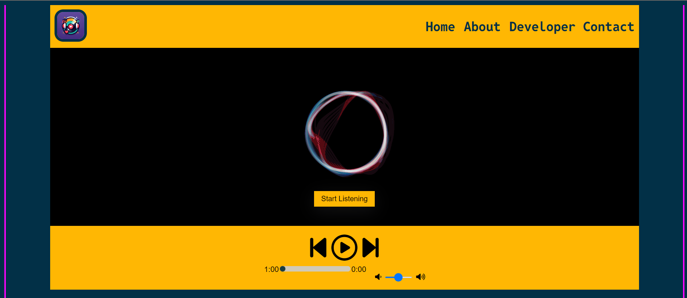
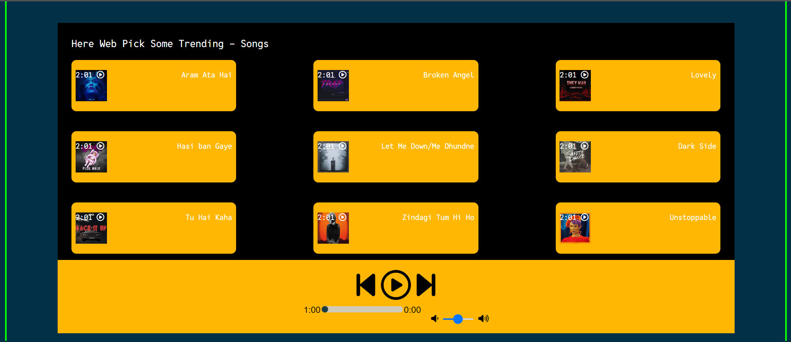

# Music Player Website

## Overview

This project is a simple yet functional music player website built using HTML, CSS, and JavaScript. It allows users to play, pause, skip tracks, and control the volume of their favorite songs. The website features a clean and user-friendly interface.

## Features

- Play and pause songs
- Skip to the next or previous song
- Display current song time and duration
- Seek to different parts of the song using a progress bar
- Control the volume
- Responsive design

## Screenshots

### Home Page


### Player View


## Logic and Implementation

### HTML Structure

The HTML file includes the basic structure of the website with the following key sections:

- **Header**: Contains the navigation bar with links to Home, About, and Developer Contact.
- **Main**: Includes the main container with a start listening button and a checkbox to show/hide the player.
- **Song List**: Displays a list of available songs with their respective play buttons.
- **Player**: Contains the controls for playing, pausing, skipping tracks, seeking, and volume control.

### JavaScript Logic

The JavaScript code handles the core functionality of the music player:

1. **Song List Initialization**: Populates the song list with song names, file paths, and cover images.

    ```javascript
    let songs = [
        {songName: "Aram Ata Hai", filePath: "Songs/1.mp3", coverPath: "covers/1.jpg"},
        {songName: "Broken Angel", filePath: "Songs/2.mp3", coverPath: "covers/2.jpg"},
        // ... more songs
    ];
    ```

2. **Play/Pause Toggle**: Adds event listeners to the play/pause button to toggle the audio playback.

    ```javascript
    const togglePlayPause = () => {
        if (audioElement.paused || audioElement.currentTime <= 0) {
            audioElement.play();
            masterPlay.classList.remove('fa-play-circle');
            masterPlay.classList.add('fa-pause-circle');
        } else {
            audioElement.pause();
            masterPlay.classList.remove('fa-pause-circle');
            masterPlay.classList.add('fa-play-circle');
        }
    };
    ```

3. **Progress Bar**: Updates the progress bar as the song plays and allows seeking.

    ```javascript
    audioElement.addEventListener('timeupdate', () => { 
        let progress = parseInt((audioElement.currentTime / audioElement.duration) * 100); 
        myProgressBar.value = progress;
    });

    myProgressBar.addEventListener('change', () => {
        audioElement.currentTime = myProgressBar.value * audioElement.duration / 100;
    });
    ```

4. **Volume Control**: Adjusts the volume of the audio element based on the slider input.

    ```javascript
    const volumeControl = document.getElementById('volumeControl');
    volumeControl.addEventListener('input', () => {
        audioElement.volume = volumeControl.value / 100;
    });
    ```

5. **Next/Previous Song**: Handles skipping to the next or previous song in the list.

    ```javascript
    document.getElementById('next').addEventListener('click', () => {
        songIndex = (songIndex >= songs.length - 1) ? 0 : songIndex + 1;
        playSong();
    });

    document.getElementById('previous').addEventListener('click', () => {
        songIndex = (songIndex <= 0) ? songs.length - 1 : songIndex - 1;
        playSong();
    });

    const playSong = () => {
        audioElement.src = songs[songIndex].filePath;
        audioElement.currentTime = 0;
        audioElement.play();
        masterPlay.classList.remove('fa-play-circle');
        masterPlay.classList.add('fa-pause-circle');
    }
    ```

### CSS Styling

The CSS file styles the layout and appearance of the website, ensuring it is responsive and visually appealing. Key styles include:

- **Layout**: Flexbox and grid layouts for structured and responsive design.
- **Colors and Fonts**: Consistent color schemes and font choices for a professional look.
- **Animations**: Simple animations for transitions and interactions.

## How to Run the Project

1. Clone the repository or download the source code.
2. Open the `index.html` file in your preferred web browser.
3. Enjoy listening to your favorite songs!

## Support the Developer

If you like this project and want to support the developer, consider buying me a coffee!

[](https://www.buymeacoffee.com/rafaymemon)

## Contact

For any inquiries or feedback, please contact me through [LinkedIn](https://www.linkedin.com/in/rafay-memon-930190253/).
